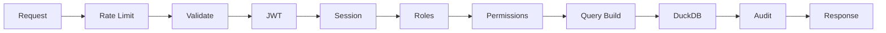

`@superapp/backend` is a data access layer that turns your databases into a secure, authenticated API. Point it at Postgres, MySQL, SQLite, or CSV files and get instant CRUD with row-level security, audit logging, and an admin UI.

```typescript
import { createEngine } from '@superapp/backend'
import { createHonoMiddleware } from '@superapp/backend/adapters/hono'
import { serve } from '@hono/node-server'
import { Hono } from 'hono'

const engine = createEngine({
  connections: {
    main: { type: 'postgres', url: process.env.PG_URL! },
  },
})

const app = new Hono()
app.route('/', createHonoMiddleware(engine))
serve({ fetch: app.fetch, port: 3001 })
```

## Routes

| Route | Method | Description |
|---|---|---|
| `/data` | `POST` | Query, insert, update, delete records |
| `/schema` | `GET` | Introspect available tables and columns |
| `/auth/*` | `*` | Authentication endpoints (login, register, session) |
| `/admin` | `GET` | Admin UI dashboard |
| `/admin/api/*` | `*` | Admin API for managing connections and permissions |

## Request Pipeline

Every `/data` request passes through a 10-step pipeline:



## Key Concepts

- **Connections** — Named database sources (Postgres, MySQL, SQLite, CSV) attached to DuckDB
- **Auth Providers** — Pluggable authentication (better-auth or custom)
- **Permissions** — Row-level security with filters, checks, and presets
- **Roles** — Named groups of permissions assigned to users
- **Adapters** — Framework bindings for Hono, Next.js, Express, and generic handlers

## Next Steps

- [createEngine](/docs/backend/create-engine) — Configure your engine
- [Connections](/docs/backend/connections) — Add database sources
- [Authentication](/docs/backend/auth/overview) — Set up auth
- [Permissions](/docs/backend/permissions/overview) — Define access rules
