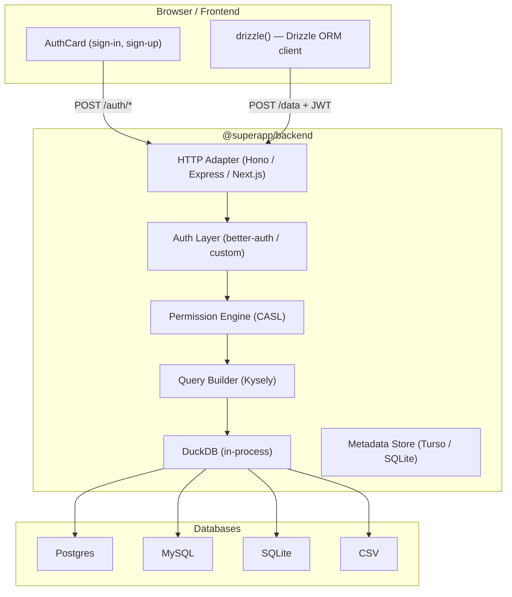
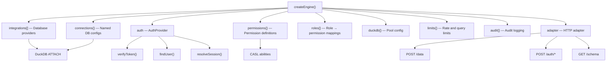

superapp is two npm packages: `@superapp/backend` (server) and `@superapp/db` (client). The server owns all data access, auth, and permissions. The client is a thin typed HTTP layer that never generates SQL.

## System Diagram



## Two Packages

### `@superapp/backend` (Server)

The backend is the single source of truth for all data access. It:

- **Accepts structured JSON requests** over HTTP (never raw SQL from clients).
- **Verifies JWTs** through a pluggable auth provider.
- **Enforces permissions** using CASL-based rules that inject row filters, restrict columns, validate writes, and preset values.
- **Translates JSON to SQL** via Kysely and executes through DuckDB, which fans out to attached databases.
- **Stores metadata** (sessions, roles, audit logs) in a Turso or local SQLite database via Drizzle ORM.

```typescript
import { createEngine } from '@superapp/backend'
import { createHonoMiddleware } from '@superapp/backend/adapters/hono'
```

### `@superapp/db` (Client)

The client is real Drizzle ORM with an HTTP driver. It:

- **Exposes standard Drizzle ORM query syntax** that mirrors your schema.
- **Sends structured JSON** to the server's `/data` endpoint.
- **Ships auth UI components** (`AuthCard`, `AuthProvider`) built with React.
- **Generates TypeScript types** from your server's `/schema` endpoint for full autocomplete.

```typescript
import { drizzle } from '@superapp/db'
import { createAuth } from '@superapp/db/auth'
import { AuthCard, AuthProvider } from '@superapp/db/components'
```

## Tech Stack

| Layer | Technology | Role |
|---|---|---|
| Query engine | DuckDB | In-process OLAP engine, ATTACH to external databases |
| HTTP framework | Hono | Lightweight, edge-compatible HTTP routing |
| Metadata store | Turso + Drizzle | Sessions, roles, audit logs, admin configuration |
| Authentication | better-auth | JWT-based auth with session management |
| Authorization | CASL | Attribute-based permission evaluation |
| SQL builder | Kysely | Type-safe SQL generation from JSON |
| Admin UI | React + Vite | Visual permission and connection management |
| Client SDK | TypeScript | Typed query builder over HTTP |

## Dependency Graph



## Request Lifecycle

Every query follows this exact path:

1. **HTTP** -- Adapter receives `POST /data` with JWT in `Authorization` header.
2. **Auth** -- `verifyToken()` validates the JWT signature. `findUser()` retrieves the user record. `resolveSession()` enriches with roles and org memberships.
3. **Permissions** -- CASL evaluates which permissions apply based on the user's role. Filters are injected into WHERE clauses. Columns are stripped to the allowed set. For writes, `check` validates the data and `preset` injects server-side values.
4. **Query Builder** -- Kysely translates the JSON request into a parameterized SQL statement.
5. **DuckDB** -- Executes the SQL against the attached database (Postgres, MySQL, SQLite, or CSV).
6. **Response** -- Results are serialized to JSON and returned to the client.

No step can be skipped. There is no "bypass" mode in production. The client never sees raw SQL, and the server never executes unvalidated queries.
