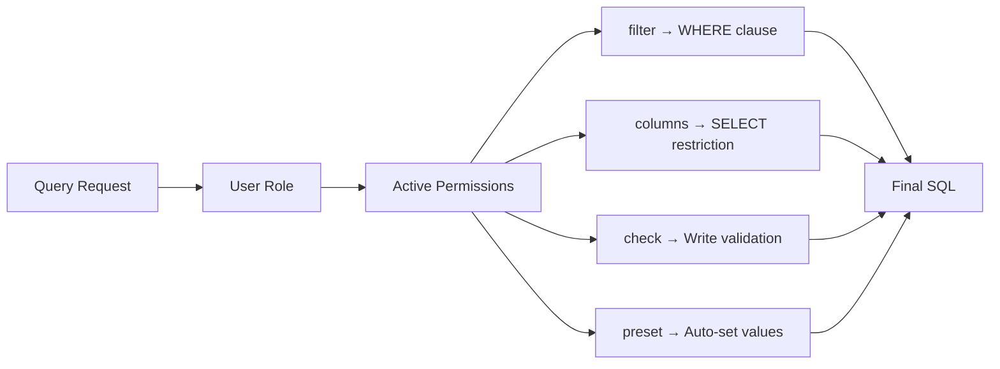

Permissions are the core security primitive in superapp. Think of each permission as a **lens** -- it defines what a user can see and do with a specific table. The lens narrows the view: which rows are visible, which columns are accessible, what data can be written, and what values are automatically injected.

## Mental Model: Permissions as Lenses

```
          All data in main.orders
┌─────────────────────────────────────────┐
│  id │ amount │ status │ customer_id │ …  │
│─────┼────────┼────────┼─────────────┼────│
│  1  │  250   │ active │  cust_001   │    │  ← other org
│  2  │  100   │ draft  │  cust_002   │    │  ← your org
│  3  │  500   │ active │  cust_002   │    │  ← your org
│  4  │  75    │ active │  cust_003   │    │  ← other org
└─────────────────────────────────────────┘

     Permission lens: "view_own_orders"
     filter: { customer_id: { $eq: '$user.customer_id' } }
     columns: ['id', 'amount', 'status']

            What the user sees
┌───────────────────────────┐
│  id │ amount │ status     │
│─────┼────────┼────────────│
│  2  │  100   │ draft      │
│  3  │  500   │ active     │
└───────────────────────────┘
```

Each CRUD operation uses a different combination of permission fields.

## CRUD Mapping

| Operation | `filter` | `columns` | `check` | `preset` |
|---|---|---|---|---|
| **SELECT** (read) | Injected into WHERE -- controls which rows are visible | Restricts which columns are returned | -- | -- |
| **INSERT** (create) | -- | Restricts which columns the user can provide | Validates the incoming data against conditions | Injects server-side values before insert |
| **UPDATE** (modify) | Injected into WHERE -- controls which rows can be updated | Restricts which columns can be set | Validates the new data against conditions | Injects server-side values before update |
| **DELETE** (remove) | Injected into WHERE -- controls which rows can be deleted | -- | -- | -- |

### How Each Field Works

**`filter`** -- A WHERE clause injected into every query. The user never sees rows that do not match. For SELECT, it restricts visibility. For UPDATE and DELETE, it restricts which rows can be modified.

**`columns`** -- An allowlist of column names. For SELECT, columns not in the list are stripped from the response. For INSERT and UPDATE, the user cannot set columns outside this list.

**`check`** -- A validation condition applied to the incoming data. Used for INSERT and UPDATE. If the data does not satisfy the check, the operation is rejected with a permission error.

**`preset`** -- Key-value pairs that the server injects into the data before writing. Used for INSERT and UPDATE. Preset values override anything the client sends for those columns.



## Permission Definition

```typescript
const engine = createEngine({
  permissions: {
    manage_own_orders: {
      name: 'Manage own orders',
      description: 'CRUD orders belonging to the user\'s organization',
      table: 'main.orders',
      operations: { select: true, insert: true, update: true, delete: true },
      columns: ['id', 'amount', 'status', 'notes', 'customer_id', 'created_at'],
      filter: {
        customer_id: { $eq: '$user.customer_id' },
      },
      check: {
        amount: { $gte: 0 },
        status: { $in: ['draft', 'active', 'cancelled'] },
      },
      preset: {
        updated_by: '$user.id',
      },
      limit: 1000,
    },
  },
})
```

## `$user.*` Substitution

Any string value starting with `$user.` is replaced at runtime with the corresponding property from the session object returned by `resolveSession`.

```
Permission definition:
  filter: { customer_id: { $eq: '$user.customer_id' } }

Session object ($user):
  { id: 'usr_42', customer_id: 'cust_002', email: 'alice@example.com' }

Resolved at runtime:
  filter: { customer_id: { $eq: 'cust_002' } }

Generated SQL:
  WHERE customer_id = 'cust_002'
```

The substitution flow:

```
1. Client sends request
     POST /data { action: 'findMany', table: 'main.orders', ... }

2. Auth resolves session
     $user = { id: 'usr_42', customer_id: 'cust_002', org_ids: ['org_1', 'org_2'] }

3. Permission engine substitutes $user.* values
     filter: { customer_id: { $eq: '$user.customer_id' } }
           → { customer_id: { $eq: 'cust_002' } }

4. Query builder generates SQL
     SELECT id, amount, status, notes, customer_id, created_at
     FROM main.orders
     WHERE customer_id = $1
     LIMIT 1000

5. DuckDB executes against Postgres
```

You can reference any property from the session object, including arrays:

```typescript
// Filter using an array property
filter: {
  organization_id: { $in: '$user.org_ids' },
}
// Resolves to: WHERE organization_id IN ('org_1', 'org_2')
```

## How Multiple Permissions Merge

When a user's role includes multiple permissions for the same table, they are merged using **union** semantics:

- **Filters** are combined with OR -- the user can see rows matching *any* of their permission filters.
- **Columns** are combined with union -- the user can access columns from *any* of their permissions.
- **Checks** are combined with OR -- a write succeeds if it satisfies *any* permission's check.
- **Presets** from the most specific matching permission are applied.

### Example: Two Permissions on the Same Table

```typescript
permissions: {
  view_own_orders: {
    table: 'main.orders',
    operations: { select: true },
    columns: ['id', 'amount', 'status'],
    filter: { customer_id: { $eq: '$user.customer_id' } },
  },
  view_team_orders: {
    table: 'main.orders',
    operations: { select: true },
    columns: ['id', 'amount', 'status', 'assigned_to', 'priority'],
    filter: { team_id: { $in: '$user.team_ids' } },
  },
}

roles: {
  team_lead: ['view_own_orders', 'view_team_orders'],
}
```

For a user with the `team_lead` role:

```sql
-- Merged filter (OR):
WHERE customer_id = $1 OR team_id IN ($2, $3)

-- Merged columns (union):
-- ['id', 'amount', 'status'] ∪ ['id', 'amount', 'status', 'assigned_to', 'priority']
-- = ['id', 'amount', 'status', 'assigned_to', 'priority']
```

## Generated SQL Examples

### SELECT with Filter and Column Restriction

```typescript
// Permission:
{
  table: 'main.orders',
  operations: { select: true },
  columns: ['id', 'amount', 'status'],
  filter: { customer_id: { $eq: '$user.customer_id' } },
}

// Client request:
db.main.orders.findMany({
  select: ['id', 'amount', 'status', 'internal_notes'],  // internal_notes not allowed
  where: { status: { $eq: 'active' } },
})

// Generated SQL:
SELECT id, amount, status           -- internal_notes stripped
FROM main.orders
WHERE customer_id = $1              -- permission filter injected
  AND status = $2                   -- user filter added
```

### INSERT with Check and Preset

```typescript
// Permission:
{
  table: 'main.orders',
  operations: { insert: true },
  columns: ['amount', 'status', 'notes'],
  check: { amount: { $gte: 0 } },
  preset: { created_by: '$user.id', organization_id: '$user.current_org_id' },
}

// Client request:
db.main.orders.create({
  data: { amount: 250, status: 'draft', notes: 'New order', organization_id: 'org_hacked' },
})

// What happens:
// 1. organization_id stripped from client data (it's a preset, server wins)
// 2. check validates: amount >= 0 → 250 >= 0 → pass
// 3. preset injects: created_by = 'usr_42', organization_id = 'org_1'

// Generated SQL:
INSERT INTO main.orders (amount, status, notes, created_by, organization_id)
VALUES ($1, $2, $3, $4, $5)
-- $1=250, $2='draft', $3='New order', $4='usr_42', $5='org_1'
```

### UPDATE with Filter, Check, and Preset

```typescript
// Permission:
{
  table: 'main.orders',
  operations: { update: true },
  columns: ['amount', 'status', 'notes'],
  filter: { customer_id: { $eq: '$user.customer_id' } },
  check: { status: { $in: ['draft', 'active', 'cancelled'] } },
  preset: { updated_by: '$user.id', updated_at: '$now' },
}

// Client request:
db.main.orders.update({
  where: { id: { $eq: 'ord_123' } },
  data: { status: 'active' },
})

// Generated SQL:
UPDATE main.orders
SET status = $1, updated_by = $2, updated_at = $3    -- preset injected
WHERE id = $4
  AND customer_id = $5                                -- permission filter injected
```

### DELETE with Filter

```typescript
// Permission:
{
  table: 'main.orders',
  operations: { delete: true },
  filter: { customer_id: { $eq: '$user.customer_id' }, status: { $eq: 'draft' } },
}

// Client request:
db.main.orders.delete({
  where: { id: { $eq: 'ord_123' } },
})

// Generated SQL:
DELETE FROM main.orders
WHERE id = $1
  AND customer_id = $2              -- permission filter
  AND status = $3                   -- permission filter ('draft' only)
```

The client never controls which rows are affected beyond the intersection of their filter and the permission filter. There is no way to bypass the injected WHERE clause.
