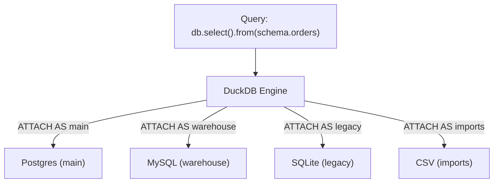

superapp uses DuckDB as an in-process query engine that can attach to multiple external databases simultaneously. This means you can query Postgres, MySQL, SQLite, and CSV sources through a single unified API -- and even join across them.

## How DuckDB ATTACH Works

DuckDB has native extensions for connecting to external databases. When the engine starts, each configured connection is attached as a named schema inside DuckDB:

```
createEngine({
  connections: {
    main:      { type: 'postgres', url: '...' },
    warehouse: { type: 'mysql',    url: '...' },
    legacy:    { type: 'sqlite',   path: './legacy.db' },
    imports:   { type: 'csv',      directory: './data/' },
  },
})
```

Under the hood, DuckDB runs:

```sql
ATTACH 'postgres:...' AS main  (TYPE postgres);
ATTACH 'mysql:...'    AS warehouse (TYPE mysql);
ATTACH 'sqlite:...'   AS legacy (TYPE sqlite);
-- CSV files are registered as views in the 'imports' namespace
```



After attachment, every table is accessible through its namespace: `main.orders`, `warehouse.events`, `legacy.customers`, `imports.products_2024`.

## Connection Namespacing

Every table reference in superapp follows the pattern `{connection}.{table}`:

```
main.orders          → Postgres table "orders"
main.customers       → Postgres table "customers"
warehouse.events     → MySQL table "events"
warehouse.sessions   → MySQL table "sessions"
legacy.users         → SQLite table "users"
imports.products     → CSV file "products.csv"
```

This namespacing is consistent across the entire system:

```typescript
// Client queries
db.select().from(schema.orders)           // main connection
db.select().from(schema.events)           // warehouse connection

// Permission definitions
permissions: {
  view_orders: {
    table: 'main.orders',          // same namespace
    // ...
  },
  view_events: {
    table: 'warehouse.events',     // same namespace
    // ...
  },
}

// Include (join) across connections
db.main.orders.findMany({
  include: {
    events: {
      table: 'warehouse.events',   // cross-database join
      on: { order_id: 'id' },
    },
  },
})
```

## Same Permission Pipeline Regardless of Source

The permission engine does not care which database type backs a table. Every query -- whether it hits Postgres, MySQL, SQLite, or a CSV file -- passes through the same pipeline:

```
Client request
  │
  ▼
JWT verification
  │
  ▼
Permission evaluation (filter, columns, check, preset)
  │
  ▼
Query builder (JSON → SQL via Kysely)
  │
  ▼
DuckDB execution → routes to correct database
  │
  ▼
Response
```

A permission on a CSV table works identically to a permission on a Postgres table:

```typescript
permissions: {
  view_imported_products: {
    table: 'imports.products',       // CSV source
    operations: { select: true },
    columns: ['sku', 'name', 'price', 'category'],
    filter: {
      category: { $in: '$user.allowed_categories' },
    },
  },
  view_orders: {
    table: 'main.orders',           // Postgres source
    operations: { select: true },
    columns: ['id', 'amount', 'status'],
    filter: {
      customer_id: { $eq: '$user.customer_id' },
    },
  },
}
```

Both permissions compile to the same CASL ability structure and produce the same kind of SQL WHERE clause. DuckDB handles the routing transparently.

## Provider Types

Providers are integration modules that teach the engine how to attach a specific database type to DuckDB.

### Built-in Providers

| Provider | Import | Connection Config | DuckDB Extension |
|---|---|---|---|
| `postgresProvider` | `@superapp/backend/integrations/postgres` | `{ type: 'postgres', url: string }` | `postgres_scanner` |
| `mysqlProvider` | `@superapp/backend/integrations/mysql` | `{ type: 'mysql', url: string }` | `mysql_scanner` |
| `sqliteProvider` | `@superapp/backend/integrations/sqlite` | `{ type: 'sqlite', path: string }` | `sqlite_scanner` |
| `csvProvider` | `@superapp/backend/integrations/csv` | `{ type: 'csv', directory: string }` | built-in |

### Native vs Custom Providers

**Native providers** use DuckDB's built-in scanner extensions. They support push-down predicates, which means DuckDB can push WHERE clauses down to the source database for efficient filtering. Postgres, MySQL, and SQLite are native providers.

**Custom providers** implement data loading in JavaScript. The CSV provider, for example, registers CSV files as DuckDB views. Custom providers do not benefit from predicate push-down -- all data is loaded into DuckDB first, then filtered.

```typescript
// Native provider: DuckDB pushes the WHERE clause to Postgres
// Only matching rows are transferred over the network
db.main.orders.findMany({
  where: { status: { $eq: 'active' } },
})
// DuckDB sends: SELECT ... FROM main.orders WHERE status = 'active' → Postgres

// CSV provider: all rows loaded, then filtered in DuckDB
db.imports.products.findMany({
  where: { category: { $eq: 'electronics' } },
})
// DuckDB loads products.csv into memory, then filters
```

### Registering Providers

Providers are registered in the `integrations` array. Only register the providers you need -- each one loads a DuckDB extension:

```typescript
import { createEngine } from '@superapp/backend'
import { postgresProvider } from '@superapp/backend/integrations/postgres'
import { mysqlProvider } from '@superapp/backend/integrations/mysql'

const engine = createEngine({
  integrations: [postgresProvider, mysqlProvider],  // only what you need
  connections: {
    main: { type: 'postgres', url: process.env.PG_URL! },
    warehouse: { type: 'mysql', url: process.env.MYSQL_URL! },
  },
})
```

## Cross-Database Joins

Because all databases are attached to the same DuckDB instance, you can join across them:

```typescript
// Join Postgres orders with MySQL analytics events
const ordersWithEvents = await db.main.orders.findMany({
  select: ['id', 'amount', 'status'],
  include: {
    events: {
      table: 'warehouse.events',
      on: { order_id: 'id' },
      select: ['event_type', 'created_at'],
    },
  },
})
```

DuckDB handles the cross-database join internally. For native providers, it fetches the relevant rows from each source and joins them in memory. Permissions apply to both sides of the join independently -- the user must have SELECT permission on both `main.orders` and `warehouse.events`.

## Performance Considerations

- **Native providers** (Postgres, MySQL, SQLite) benefit from predicate push-down. DuckDB pushes filters to the source, reducing data transfer.
- **CSV sources** are loaded fully into DuckDB memory. Use the `duckdb.maxMemory` setting to control how much memory DuckDB can use.
- **Cross-database joins** require DuckDB to fetch data from both sources. For large joins, consider materializing frequently-joined data.
- **Connection pooling** is handled per-provider. DuckDB maintains its own connection pool to each attached database, configured via `duckdb.poolSize` and `duckdb.idleTimeout`.
