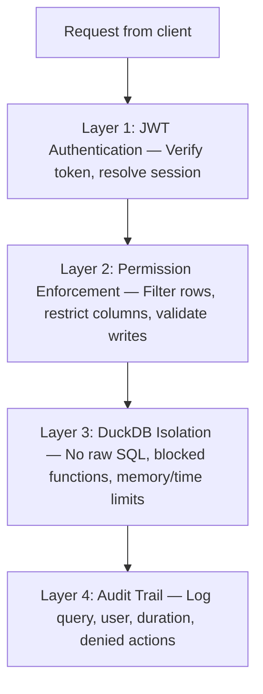

superapp uses a four-layer defense-in-depth model. Every query must pass through all four layers. There is no shortcut, no bypass flag, and no god mode.

## The Four Layers



## Layer 1: JWT Authentication

Every request to `/data` must include a valid JWT in the `Authorization` header. The auth layer:

1. **Verifies the token signature** against the configured algorithm (RS256, ES256, HS256).
2. **Checks expiration** -- expired tokens are rejected immediately.
3. **Looks up the user** in the configured `userTable` using the JWT payload.
4. **Enriches the session** via `resolveSession()` to attach roles, organization memberships, and any custom properties.

If any step fails, the request is rejected with a `401 Unauthorized` response. No query is executed.

```typescript
auth: betterAuthProvider({
  secret: process.env.AUTH_SECRET!,
  userTable: {
    table: 'main.users',
    matchOn: { column: 'id', jwtField: 'id' },
  },
})
```

### What Happens Without Auth

If no `auth` provider is configured, the engine operates in **open mode** -- all queries are executed without authentication. This is intended for local development only. In production, always configure an auth provider.

## Layer 2: Permission Enforcement

After authentication, the permission engine evaluates what the user can do. This layer uses CASL to compile permission rules into runtime ability checks.

### No Permission = No Access

If no permission grants access to a table or operation, the request is rejected with `403 Forbidden`. There is no default "allow all" behavior.

```
User with role "viewer" requests:
  db.main.orders.findMany(...)

Permission check:
  1. Find all permissions for role "viewer" on table "main.orders"
  2. Check if any permission allows operation "select"
  3. If yes → inject filters, restrict columns, proceed
  4. If no  → 403 Forbidden, query never executes
```

### No God Mode

There is no superuser role that bypasses permissions. Even the `masterKey` authenticates admin API access -- it does not grant unrestricted data access. Admin operations (connection management, permission editing in managed mode) are a separate authorization path from data queries.

### Row-Level Security

Filters are injected into every query's WHERE clause. The user cannot remove, modify, or override these filters. They are invisible to the client:

```typescript
// Permission filter
filter: { organization_id: { $in: '$user.org_ids' } }

// User sends:
db.main.orders.findMany({ where: { status: { $eq: 'active' } } })

// Executed SQL:
SELECT ... FROM main.orders
WHERE organization_id IN ($1, $2)   -- permission filter (mandatory)
  AND status = $3                   -- user filter (optional)
```

### Column-Level Security

Only columns listed in the permission's `columns` array are accessible. If the user requests a column they do not have permission for, it is silently stripped from the response -- not returned, not errored.

### Write Validation

For INSERT and UPDATE operations:

- **`check`** validates incoming data against conditions. If the data fails, the write is rejected.
- **`preset`** injects server-side values that the client cannot override. Even if the client sends a value for a preset column, the server's value wins.

## Layer 3: DuckDB Isolation

DuckDB is the execution engine. Even after a query passes auth and permissions, DuckDB enforces additional constraints.

### No Raw SQL

The client never sends SQL. It sends structured JSON (`{ action, table, where, select, ... }`), which the server translates to parameterized SQL via Kysely. SQL injection is structurally impossible because user input is never interpolated into SQL strings.

### Blocked Operations

The following DuckDB capabilities are disabled:

| Blocked Feature | Reason |
|---|---|
| `COPY TO/FROM` | Prevents file system reads and writes |
| File path access | No reading files from the server's filesystem |
| `CREATE TABLE` / `DROP TABLE` | Schema modifications are blocked |
| System functions (`pg_*`, `sqlite_*`) | No access to database internals |
| `INSTALL` / `LOAD` | Cannot load arbitrary DuckDB extensions at runtime |
| `PRAGMA` statements | No runtime configuration changes |
| Shell commands | No `system()` or similar escapes |

### Resource Limits

DuckDB is configured with hard limits to prevent resource exhaustion:

```typescript
duckdb: {
  maxMemory: '256MB',     // per-instance memory cap
  threads: 2,             // CPU thread limit
  queryTimeout: 30_000,   // 30-second max execution time
  poolSize: 10,           // connection pool size
  idleTimeout: 300_000,   // reclaim idle connections after 5 minutes
}
```

If a query exceeds the memory or time limit, it is killed and the client receives an error. The DuckDB instance remains healthy for subsequent queries.

### Session Isolation

Each query runs in its own DuckDB connection from the pool. Connections are not shared between concurrent requests. One user's query cannot read another user's in-progress results or temporary state.

## Layer 4: Audit Trail

Every query is logged with configurable detail:

```typescript
audit: {
  enabled: true,
  logQuery: true,          // the SQL that was executed
  logParams: true,         // query parameters (for debugging)
  logDuration: true,       // execution time in milliseconds
  logUser: true,           // who executed the query
  logDenied: true,         // log permission denials
  logAdminActions: true,   // log admin UI changes
  retention: '90d',        // auto-delete logs older than 90 days
  piiRedaction: true,      // redact email, phone, etc. from logs
}
```

Audit logs are stored in the metadata database (Turso/SQLite) and are queryable through the admin UI. When `logDenied` is enabled, failed permission checks are logged -- useful for detecting unauthorized access attempts.

## Error Sanitization

superapp returns different error detail levels based on the environment:

### Production (default)

```json
{
  "error": "PERMISSION_DENIED",
  "message": "You do not have permission to perform this action.",
  "correlation_id": "req_abc123"
}
```

No table names, no column names, no SQL, no filter details. The `correlation_id` lets you look up the full error in server logs.

### Development

```json
{
  "error": "PERMISSION_DENIED",
  "message": "No SELECT permission on table 'main.orders' for role 'viewer'. Required permission grants SELECT with filter on customer_id.",
  "correlation_id": "req_abc123",
  "details": {
    "table": "main.orders",
    "operation": "select",
    "role": "viewer",
    "evaluated_permissions": ["view_own_orders"]
  }
}
```

Verbose errors are enabled automatically when `NODE_ENV !== 'production'`. You can also control this with the `security` configuration.

## Security Checklist

Before deploying to production:

- [ ] `auth` provider is configured with a strong secret
- [ ] `masterKey` is set via environment variable, not hardcoded
- [ ] Every table that users query has at least one permission defined
- [ ] `audit.enabled` is `true`
- [ ] `security.cors.origin` is set to your frontend domain(s), not `*`
- [ ] `duckdb.maxMemory` and `duckdb.queryTimeout` are set to reasonable values
- [ ] `limits.rateLimitPerUser` and `limits.rateLimitPerIP` are configured
- [ ] `NODE_ENV=production` is set to enable opaque error messages
