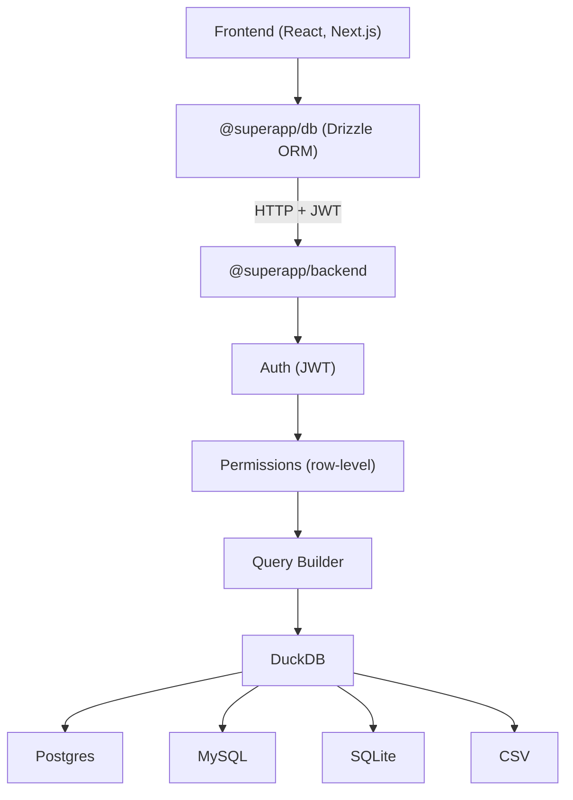

One library to connect your frontend to any database — with auth, permissions, and type safety built in.

## What is superapp?

superapp is two packages that form a complete data access layer:

- **`@superapp/backend`** — The server engine. Connects to Postgres, MySQL, SQLite, or CSV files through DuckDB, enforces row-level permissions, handles auth via better-auth, and ships with an admin UI for managing everything visually.
- **`@superapp/db`** — The client SDK. Real Drizzle ORM with an HTTP driver plugin. Full type safety, pre-built auth UI components, zero server dependencies.

## Architecture



## Key Features

- **Type-safe queries** — Your frontend code gets full autocomplete and type checking against your actual database schema.
- **Automatic row-level security** — Permissions inject WHERE clauses into every query. Users only see their own data without you writing filter logic.
- **Multi-database via DuckDB** — Query Postgres, MySQL, SQLite, and CSV files through a single interface. Join across databases.
- **Plug-and-play auth** — better-auth integration with pre-built UI components. Sign-in, sign-up, and user management out of the box.
- **Visual permission editor** — An admin UI to create roles and permissions without touching code.
- **Audit logging** — Every query, every permission denial, every admin action is logged with full context.

## Who is This For?

- **SaaS teams** building multi-tenant applications where each customer must only see their own data.
- **Internal tools** that need to query production databases safely, with guardrails.
- **Multi-tenant apps** where row-level security and organization-scoped access are table stakes.

## Quick Example

**Server** (`server.ts`):

```typescript
import { createEngine } from '@superapp/backend'
import { betterAuthProvider } from '@superapp/backend/auth/better-auth'
import { postgresProvider } from '@superapp/backend/integrations/postgres'
import { createHonoMiddleware } from '@superapp/backend/adapters/hono'
import { Hono } from 'hono'
import { serve } from '@hono/node-server'

const engine = createEngine({
  database: './superapp.db',
  integrations: [postgresProvider],
  connections: {
    main: { type: 'postgres', url: process.env.PG_URL! },
  },
  auth: betterAuthProvider({ secret: process.env.AUTH_SECRET! }),
  masterKey: process.env.SUPERAPP_MASTER_KEY!,
  permissions: {
    view_own_orders: {
      table: 'main.orders',
      operations: { select: true },
      columns: ['id', 'amount', 'status', 'created_at'],
      filter: {
        organization: {
          members: { user_id: { $eq: '$user.id' } },
        },
      },
    },
  },
  roles: {
    viewer: ['view_own_orders'],
  },
})

const app = new Hono()
app.route('/', createHonoMiddleware(engine))
serve({ fetch: app.fetch, port: 3001 })
```

**Client** (`lib/superapp.ts`):

```typescript
import { drizzle } from '@superapp/db'
import { createAuth } from '@superapp/db/auth'
import * as schema from '../generated/schema'

export const authClient = createAuth('http://localhost:3001')

export function createDb(token: string) {
  return drizzle({
    connection: 'http://localhost:3001',
    token,
    schema,
  })
}
```

**Query** (anywhere in your frontend):

```typescript
import { eq, desc } from 'drizzle-orm'

const orders = await db.select()
  .from(schema.orders)
  .where(eq(schema.orders.status, 'active'))
  .orderBy(desc(schema.orders.createdAt))
  .limit(50)
```

## What's Next

- [Installation](/docs/getting-started/installation) — Install the server engine and client SDK.
- [Quick Start](/docs/getting-started/quick-start) — Get running in 5 minutes.
